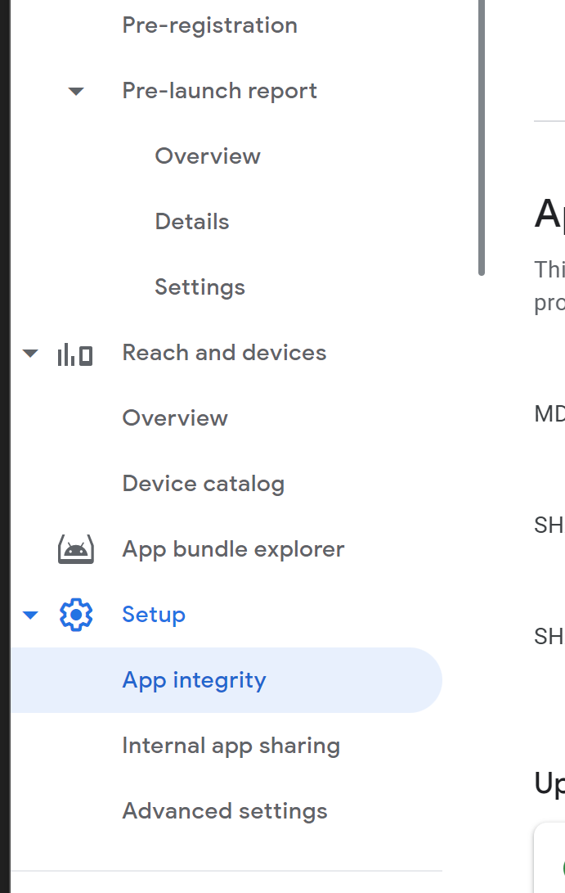

[Browser compatibility matrix](../Browser/Browser-compatibility-matrix)

## Install your Wekan server as an app

- At below info, `Navigate to login page of Wekan` is your Wekan server, example https://wekan.yourcompany.com/sign-in
- App icon at Windows desktop, mobile etc
- App does not have webbrowser buttons like address bar
- Works in Wekan v4.02 and newer

### Windows desktop: Windows Chromium Edge

1. Open Chromium Edge.

2. Navigate to login page of Wekan

3. From Edge menu, install site as app, by clicking top right `⋮` and this menu, that can be used to install and manage/remove apps:


4. In next popup, give name to app, like `YourCompany WeKan`, and click `Add`

5. Now new app is in your Windows Start menu. 

### iOS Safari

1. Open Safari.

2. Navigate to login page of Wekan.

3. At middle bottom click Share button that is box with arrow up.

4. Scroll down and click "Add to Home Screen" and "Add".

### Android Chrome

1. Open Chrome

2. Navigate to login page of Wekan.

3. Click top right menu `⋮` / Add to home screen.

4. Follow the onscreen instructions to install.

### Android Firefox (if that feature works and is not removed)

1. Open Firefox.

2. Navigate to login page of Wekan.

3. At right side of URL address, click button that has + inside of home icon.

4. Follow the onscreen instructions to install.

### Android Brave

1. Open Brave.

2. Navigate to login page of Wekan.

3. Click bottom right menu `⋮` / Add to home screen.

4. Follow the onscreen instructions to install.

### Android Opera

1. Open Opera.

2. Navigate to login page of Wekan.

3. Click top right menu `⋮` / Add to / Home screen.

4. Follow the onscreen instructions to install.

### Android Vivaldi

1. Open Vivaldi.

2. Navigate to login page of Wekan.

3. At right side of URL address, click [V] / Add to home screen.

4. Follow the onscreen instructions to install.

## Fullscreen Android app with Caddy and WeKan Server

These are mostly just notes to WeKan maintainer xet7 itself, how xet7 did get official WeKan Android Play Store app working at fullscreen of Android phone and Android tablet. Requires a lot time to setup, not recommended.

Related, for creating apps to other appstores: https://github.com/wekan/wekan/wiki/Browser-compatibility-matrix

1. https://www.pwabuilder.com to create Android app. Select fullscreen when creating app, also requires  correctly installed assetlinks.json with below Caddy config to get fullscreen. When creating app, make your own signing key if you don't have one yet. Releasing Android app is at Play Console https://play.google.com/console/ .

2. PWABuilder has about 100+ downloadable icons etc webmanifest requirements like is at https://github.com/wekan/wekan/tree/main/public

3. Clone WeKan repo, add favicons etc from step 2 to wekan/public/ , and build WeKan bundle from source like at https://github.com/wekan/wekan/wiki/Emoji . Note: Currently WeKan does not have feature for custom favicons, it would require a lot of work for 100+ favicons etc customizations.

4. Run bundle at server like https://github.com/wekan/wekan/wiki/Offline or https://github.com/wekan/wekan/wiki/Raspberry-Pi

5. Install Caddy like https://github.com/wekan/wekan/wiki/Caddy-Webserver-Config , with this config for PWA at https://boards.example.com , there add assetlinks.json details you got when you downloaded Android .zip file from https://pwabuilder.com , see assetlinks issue about where at Play Console those 2 SHA256 keys https://github.com/pwa-builder/PWABuilder/issues/3867#issuecomment-1450826565

6. At Play Console https://play.google.com/console/ there is `App Integrity` button in the sidemenu (highlighted blue in the screenshot) where you find required 2 SHA256 keys for Caddyfile:



7. Caddy uses tabs for indenting. At `/etc/caddy` you can also `caddy format > ca` to format output and forward to new file, and if it works then `mv ca Caddyfile` and validate it `caddy validate` and reload `caddy reload`. Sometimes update caddy with `caddy upgrade` and after that `caddy stop` and `caddy start`.

8. Also related is Parallel Snaps install to one server at encrypted VM at https://github.com/wekan/wekan-snap/wiki/Many-Snaps-on-LXC

9. In newest requirements installing assetlinks.json is to PWA URL (like https://boards.example.com), when it before was to main domain (like https://example.com), so here just in case it's installed to both, as text in `/etc/caddy/Caddyfile`. Also see https://docs.pwabuilder.com/#/builder/android

10. For figuring out Caddy 2 config, xet7 found related tips from Caddy forum https://caddy.community/t/well-known-file-location/16632/4

`/etc/caddy/Caddyfile`

```
# Redirecting http to https

(redirect) {
        @http {
                protocol http
        }
        redir @http https://{host}{uri}
}

example.com {
        tls {
                alpn http/1.1
        }
        header /.well-known/* Content-Type application/json
        header /.well-known/* Access-Control-Allow-Origin *
        respond /.well-known/assetlinks.json `[
  {
    "relation": ["delegate_permission/common.handle_all_urls"],
    "target": {
      "namespace": "android_app",
      "package_name": "team.example.boards.twa",
      "sha256_cert_fingerprints": [
        "AA:AA... FIRST SHA256 KEY",
        "61:41... 2nd SHA256 KEY"
      ]
    }
  }
]`
        root * /data/websites/example.com
        file_server
}

boards.example.com {
        tls {
                alpn http/1.1
        }
        header /.well-known/* Content-Type application/json
        header /.well-known/* Access-Control-Allow-Origin *
        respond /.well-known/assetlinks.json `[
  {
    "relation": ["delegate_permission/common.handle_all_urls"],
    "target": {
      "namespace": "android_app",
      "package_name": "team.example.boards.twa",
      "sha256_cert_fingerprints": [
        "AA:AA... FIRST SHA256 KEY",
        "61:41... 2nd SHA256 KEY"
      ]
    }
  }
]`
        reverse_proxy 192.168.100.3:3025
}
```
